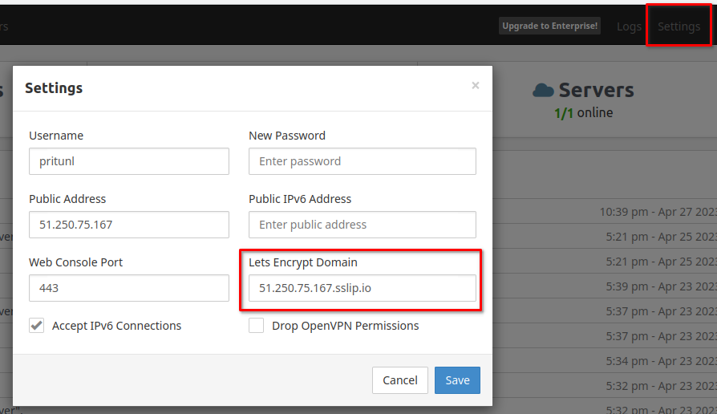

# HW-03 Infra

## Bastion

### Create ssh-keys

```sh
ssh-keygen -t rsa -f ~/.ssh/nik -C nik -P ""
cat ~/.ssh/nik.pub
```
Add `nik.pub` to yandex cloud.

### Start ssh-agent and add key

```sh
 eval `ssh-agent`
 ssh-add ~/.ssh/<private_key>
```
Current public keys in agent:
```sh
ssh-add -L
```
### Connect to internal host with bastion

1. With ProxyJump ssh flag:
    `ssh -A -J <bastion_host> <internal_host>`

2. With ssh-config
    Create `~/.ssh/config:

    ```sh
    Host bastion
    HostName <Your bastion IP>
    User appuser

    Host internal-host
    HostName  <Your Internal-host ip>
    ProxyJump bastion
    User appuser
    ```
    2.2 Connect to internal:

    ```sh
    ssh internal-host
    ```
## VPN Installation

Connect to bastion host and run:

```sh
cat <<': cat <<EOF> setupvpn.sh
#!/bin/bash -e
echo "deb http://repo.pritunl.com/stable/apt jammy main" | sudo tee /etc/apt/sources.list.d/pritunl.list
apt-key adv --keyserver hkp://keyserver.ubuntu.com --recv 7568D9BB55FF9E5287D586017AE645C0CF8E292A
curl https://raw.githubusercontent.com/pritunl/pgp/master/pritunl_repo_pub.asc | sudo apt-key add -
wget -qO - https://www.mongodb.org/static/pgp/server-6.0.asc |  gpg --dearmor | sudo tee /usr/share/keyrings/mongodb.gpg > /dev/null
echo "deb [ arch=amd64,arm64 signed-by=/usr/share/keyrings/mongodb.gpg ] https://repo.mongodb.org/apt/ubuntu jammy/mongodb-org/6.0 multiverse" | sudo tee /etc/apt/sources.list.d/mongodb-org-6.0.list
sudo apt update
apt update
apt install -y wireguard wireguard-tools
ufw disable
apt install -y pritunl mongodb-org
systemctl enable mongod pritunl
systemctl start mongod pritunl
EOF
chmod +x setupvpn.sh
./setupvpn.sh
```
After install open `https://<bastion_host>/login` in browser
On bastion_host set mongo-db uri:
```sh
   sudo pritunl set-mongodb mongodb://localhost:27017/pritunl
   sudo pritunl setup-key
```
Copy generated key to browser
Generate default-password:
```sh
    sudo pritunl default-password
```
Copy generated username and password to browser
# Add LetsEncrypt SSL Certificate

Add domain <ip>.sslip.io in pritunl



# Ips

bastion_IP = 51.250.75.167

someinternalhost_IP = 10.128.0.18


# HW-04 CloudApp

## Create cloud instance:

` yc compute instance create   --name reddit-app   --hostname reddit-app   --memory=4   --create-boot-disk image-folder-id=standard-images,image-family=ubuntu-1604-lts,size=10GB   --network-interface subnet-name=default-ru-central1-b,   nat-ip-version=ipv4   --metadata serial-port-enable=1   --ssh-key ~/.ssh/appuser.pub`

## Startup manual:

  - Run Create instance
  - Copy scripts:
     `deploy.sh`
     `install_mongodb.sh`
     `install_ruby.sh`
     `startup.sh`
  - Run `startup.sh` on instance

## Startup auto

  Execute `yc_instance_create.sh` script

## Ips

testapp_IP = 158.160.67.56

testapp_port = 9292

# HW-05 Packer

## Create service yc account

```
FOLDER_ID=$(yc config list | grep folder-id  | cut -d ":" -f2 | xargs)
SERVICE_NAME="serviceacc"
yc iam service-account create --name=$SERVICE_NAME --folder-id=$FOLDER_ID
# Access rules
ACCT_ID=$(yc iam service-account get $SERVICE_NAME | \
          grep ^id | \
                    awk '{print [}')
                    echo "ACCT_ID=$ACCT_ID"
                    yc resource-manager folder add-access-binding --id $FOLDER_ID --service-account-id $ACCT_ID \
                        --role editor

#  create IAM key
 yc iam key create --service-account-id $ACCT_ID --output ./key.json
 ']}')
 
```

## Install packer

` wget https://hashicorp-releases.yandexcloud.net/packer/1.8.6/packer_1.8.6_linux_amd64.zip && unzip packer_1.8.6_linux_amd64.zip `
Add to PATH var or copy packer to /usr/bin

## Create vm image:

`cd packer &&  packer build   -var-file=variables.json ./immutable.json `

## Create compute instance

`config-scripts/create-reddit-vm.sh`

## Ips

testapp_IP = 130.193.51.233

testapp_port = 9292


# HW-06 terraform-1

## Structure
- `terraform/main.tf` describes creation instances reddit-app
- `terraform/outputs.tf`  - output variables in stdout
- `terraform/variables.tf` - describes variables
- `terraform/tfvars.example` - example of vars initialize 
- `terraform/lb.tf` - network load balancer

## Deploy

- Create yc service account and add editor permission.
- Enter in `terraform` directory
- Run commands: 
   ```
    terraform init
    terraform apply
   ```
## Run Check

`terraform output | grep external_ip_address_lb`

Open in browser http://external_ip_address_lb


## HW-07 terraform 2

 - Crate packer images for db and app
 - Create modules app,db,vpc
 - Create stage and prod environment based by modules
 - Create access-key for backend storage
 - Create storage for terraform.tfstate
 - Add provisioners for autostart db and app

## Run
  - Go to stage/prod directory
  - Run commands: 
   ```
    terraform init
    terraform apply
   ```


# HW-08 Ansible-1

## Check python version:

```
 python --version
  Python 2.7.18

 python3 --version
   Python 3.11.2
 
```

## Install ansible

  In debian 12 on my host PC:


  ```
     apt update && apt install -y ansible

  ```

  OR install with pip

  ```
   
   echo "ansible>=2.4" > requirements.txt
   pip install -r requirements.txt

  ```

## Check ansible version

  ```
  ansible --version
  ansible [core 2.14.3]
  config file = /home/nik/.ansible.cfg
  configured module search path = ['/home/nik/.ansible/plugins/modules', '/usr/share/ansible/plugins/modules']
  ansible python module location = /usr/lib/python3/dist-packages/ansible
  ansible collection location = /home/nik/.ansible/collections:/usr/share/ansible/collections
  executable location = /usr/bin/ansible
  python version = 3.11.2 (main, Mar 13 2023, 12:18:29) [GCC 12.2.0] (/usr/bin/python3)
  jinja version = 3.1.2
  libyaml = True

  ```

## Start stage infrastructure

```
cd terraform/stage && terraform apply
```

## Test connection

After create inventory file with appserver, run ansible ping module

```
ansible appserver -i ./inventory -m ping 
appserver | SUCCESS => {
    "ansible_facts": {
        "discovered_interpreter_python": "/usr/bin/python3"
    },
    "changed": false,
    "ping": "pong"
}


```

Add in inventory dbserver, and ping 

```
ansible dbserver -i ./inventory -m ping 
dbserver | SUCCESS => {
    "ansible_facts": {
        "discovered_interpreter_python": "/usr/bin/python3"
    },
    "changed": false,
    "ping": "pong"
}


```

## Add ansible.cfg for configure keys, user by default, run uptime command
```

ansible dbserver -m command -a uptime
dbserver | CHANGED | rc=0 >>
 13:41:51 up 22 min,  1 user,  load average: 0.01, 0.00, 0.00

```

## Add groups app and db in inventory

```
[app]
appserver ansible_host=158.160.30.62
[db]
dbserver ansible_host=158.160.22.233

```

Run ping

```
ansible app -m ping
appserver | SUCCESS => {
    "ansible_facts": {
        "discovered_interpreter_python": "/usr/bin/python3"
    },
    "changed": false,
    "ping": "pong"
}

```

## Change inventory to yaml format

inventory.yaml

```
app:
  hosts: 
    appserver:
      ansible_host: 158.160.30.62
db:
  hosts:
    dbserver:
      ansible_host: 158.160.22.233 

```

Ping all

```
ansible all -m ping  -i inventory.yaml
dbserver | SUCCESS => {
    "ansible_facts": {
        "discovered_interpreter_python": "/usr/bin/python3"
    },
    "changed": false,
    "ping": "pong"
}
appserver | SUCCESS => {
    "ansible_facts": {
        "discovered_interpreter_python": "/usr/bin/python3"
    },
    "changed": false,
    "ping": "pong"
    }
```

## Run commands

```
ansible app -m command -a 'ruby -v'
appserver | CHANGED | rc=0 >>
ruby 2.3.1p112 (2016-04-26) [x86_64-linux-gnu]
nik@debianPC:~/workspace/otus/NikRusanov_infra/
```

### Failed command: 

```

ansible app -m command -a 'ruby -v; bundler -v'
appserver | FAILED | rc=1 >>
ruby: invalid option -;  (-h will show valid options) (RuntimeError)non-zero return code

```

### Use shell module:

```

ansible app -m shell -a 'ruby -v; bundler -v'
appserver | CHANGED | rc=0 >>
ruby 2.3.1p112 (2016-04-26) [x86_64-linux-gnu]
Bundler version 1.11.2

```

### Watch mongod status with command: 

```
ansible db -m command -a 'systemctl status mongod'
dbserver | CHANGED | rc=0 >>
● mongod.service - MongoDB Database Server
   Loaded: loaded (/lib/systemd/system/mongod.service; enabled; vendor preset: enabled)
   Active: active (running) since Mon 2023-09-11 13:19:57 UTC; 32min ago
     Docs: https://docs.mongodb.org/manual
 Main PID: 774 (mongod)
   CGroup: /system.slice/mongod.service
           └─774 /usr/bin/mongod --config /etc/mongod.conf

Sep 11 13:19:57 epdak0egmgdpsc7dp4mh systemd[1]: Started MongoDB Database Server.

```

### Watch mongod status with systemd module 

```
 ansible db -m systemd -a name=mongod
dbserver | SUCCESS => {
    "ansible_facts": {
        "discovered_interpreter_python": "/usr/bin/python3"
    },
    "changed": false,
    "name": "mongod",
    "status": {
        "ActiveEnterTimestamp": "Mon 2023-09-11 13:19:57 UTC",
        "ActiveEnterTimestampMonotonic": "23280347",
        "ActiveExitTimestamp": "Mon 2023-09-11 13:19:57 UTC",
        ...
```

### Watch modgod status with service module

```
 ansible db -m service -a name=mongod
dbserver | SUCCESS => {
    "ansible_facts": {
        "discovered_interpreter_python": "/usr/bin/python3"
    },
    "changed": false,
    "name": "mongod",
    "status": {
        "ActiveEnterTimestamp": "Mon 2023-09-11 13:19:57 UTC",
        "ActiveEnterTimestampMonotonic": "23280347",
        "ActiveExitTimestamp": "Mon 2023-09-11 13:19:57 UTC",


```


## Run git clone

```
ansible app -m git -a  'repo=https://github.com/express42/reddit.git dest=/home/ubuntu/reddit'
appserver | FAILED! => {
    "ansible_facts": {
        "discovered_interpreter_python": "/usr/bin/python3"
    },
    "changed": false,
    "cmd": [
        "/usr/bin/git",
        "fetch",
        "--tags",
        "origin"
    ],
    "msg": "Failed to download remote objects and refs:  error: cannot open .git/FETCH_HEAD: Permission denied\n\n"
}
```

Failed, permission deniend (root:root on server). Add `--become` to execute with privilege

```
ansible app -m git -a  'repo=https://github.com/express42/reddit.git dest=/home/ubuntu/reddit' --become
appserver | SUCCESS => {
    "after": "5c217c565c1122c5343dc0514c116ae816c17ca2",
    "ansible_facts": {
        "discovered_interpreter_python": "/usr/bin/python3"
    },
    "before": "5c217c565c1122c5343dc0514c116ae816c17ca2",
    "changed": false,
    "remote_url_changed": false
}

```

If we run clone with `command` module, we get bash error

## Ansible play

ansible-playbook clone.yml

Result, 0 changes: 

```
PLAY [Clone] *******************************************************************************************************************************************************************************************************************************

TASK [Gathering Facts] *********************************************************************************************************************************************************************************************************************
ok: [appserver]

TASK [Clone repo] **************************************************************************************************************************************************************************************************************************
ok: [appserver]

PLAY RECAP *********************************************************************************************************************************************************************************************************************************
appserver                  : ok=2    changed=0    unreachable=0    failed=0    skipped=0    rescued=0    ignored=0   


```

Remove reddit and repeat:

```
ansible app -m command -a 'rm -rf /home/ubuntu/reddit' --become
appserver | CHANGED | rc=0 >>

```


```
ansible-playbook clone.yaml 

PLAY [Clone] *******************************************************************************************************************************************************************************************************************************

TASK [Gathering Facts] *********************************************************************************************************************************************************************************************************************
ok: [appserver]

TASK [Clone repo] **************************************************************************************************************************************************************************************************************************
changed: [appserver]

PLAY RECAP *********************************************************************************************************************************************************************************************************************************
appserver                  : ok=2    changed=1    unreachable=0    failed=0    skipped=0    rescued=0    ignored=0   
```


Changed 1 status, app cloned again


## JSON static inventory

Run with inventory.json

```
ansible-playbook clone.yaml  -i inventory.json

PLAY [Clone] *******************************************************************************************************************************************************************************************************************************

TASK [Gathering Facts] *********************************************************************************************************************************************************************************************************************
ok: [158.160.30.62]

TASK [Clone repo] **************************************************************************************************************************************************************************************************************************
ok: [158.160.30.62]

PLAY RECAP *********************************************************************************************************************************************************************************************************************************
158.160.30.62              : ok=2    changed=0    unreachable=0    failed=0    skipped=0    rescued=0    ignored=0

```

## Run with dynamic inventory 
  After terraform apply:
  - cd to ansible directory
  - run: 
    ```./scripts/run_with_terraform_inventory.sh```
